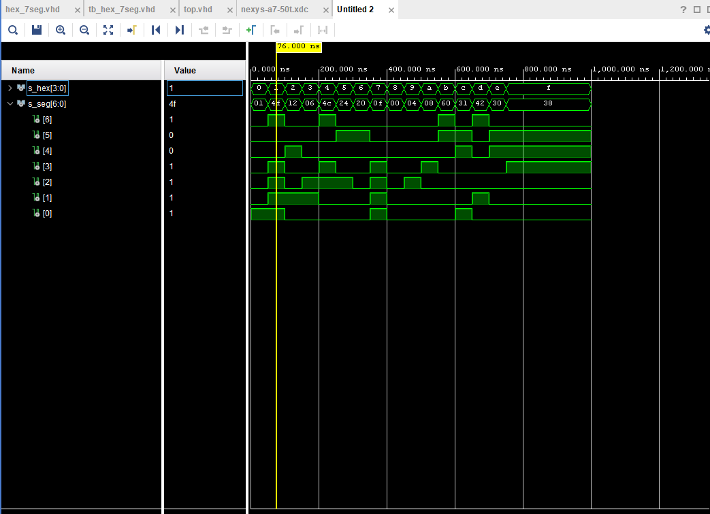

# Lab 4: NATALIE VYCHODILOVA

### Seven-segment display decoder

1. Listing of VHDL stimulus process from testbench file (`tb_hex_7seg.vhd`) with asserts. Verify all input combinations. Always use syntax highlighting, meaningful comments, and follow VHDL guidelines:

```vhdl
    p_stimulus : process
    begin
        report "Stimulus process started" severity note;

        -- First test case
        s_hex <= "0000"; wait for 50 ns;
        s_hex <= "0001"; wait for 50 ns;
        s_hex <= "0010"; wait for 50 ns;
        s_hex <= "0011"; wait for 50 ns;
        s_hex <= "0100"; wait for 50 ns;
        s_hex <= "0101"; wait for 50 ns;
        s_hex <= "0110"; wait for 50 ns;
        s_hex <= "0111"; wait for 50 ns;
        s_hex <= "1000"; wait for 50 ns;
        s_hex <= "1001"; wait for 50 ns;
        s_hex <= "1010"; wait for 50 ns;
        s_hex <= "1011"; wait for 50 ns;
        s_hex <= "1100"; wait for 50 ns;
        s_hex <= "1101"; wait for 50 ns;
        s_hex <= "1110"; wait for 50 ns;
        s_hex <= "1111"; wait for 50 ns;
        
        assert (s_seg = "0000001")
        report "Input combination 0000 FAILED" severity error;

        report "Stimulus process finished" severity note;
        wait;
    end process p_stimulus;
```

2. Screenshot with simulated time waveforms. Always display all inputs and outputs (display the inputs at the top of the image, the outputs below them) at the appropriate time scale!

   

### LED(7:4) indicators
1. Truth table: 
|Hex	|Inputs	|LED4	|LED5	|LED6	|LED7|
| :-:   | :-:   | :-:   | :-:   | :-:   | :-: | 
|0	|0000	|1	|0	|0	|0|
|1	|0001	|0	|0	|1	|1|
|2	|0010	|0	|0	|0	|1|
|3	|0011	|0	|0	|1	|0|
|4	|0100	|0	|0	|0	|1|
|5	|0101	|0	|0	|1	|0|
|6	|0110	|0	|0	|0	|0|
|7	|0111	|0	|0	|1	|0|
|8	|1000	|0	|0	|0	|1|
|9	|1001	|0	|0	|1	|0|
|A	|1010	|0	|1	|0	|0|
|b	|1011	|0	|1	|1	|0|
|C	|1100	|0	|1	|0	|0|
|d	|1101	|0	|1	|1	|0|
|E	|1110	|0	|1	|0	|0|
|F	|1111	|0	|1	|1	|0|

2. Listing of LEDs(7:4) part of VHDL architecture from source file `top.vhd`. Try to write logic functions as simple as possible. Always use syntax highlighting, meaningful comments, and follow VHDL guidelines:

   ```vhdl
   -- Display input value on LEDs
    -- Experiments on your own: LED(7:4) indicators

    -- Turn LED(4) on if input value is equal to 0 (0 because we turn on LED by 0)
       LED(4) <= '0' when (SW = "0000");

    -- Turn LED(5) on if input value is greater than "1001", ie 10, 11, 12, ...
       LED(5) <= '0' when (SW > "1001");

    -- Turn LED(6) on if input value is odd, ie 1, 3, 5, ...
       LED(6) <= '0' when (SW(0)='1');

    -- Turn LED(7) on if input value is a power of two, ie 1, 2, 4, or 8
       LED(7) <= '0' when (SW = "0001" or SW = "0010" or SW = "0100" or SW = "1000");
   ```
